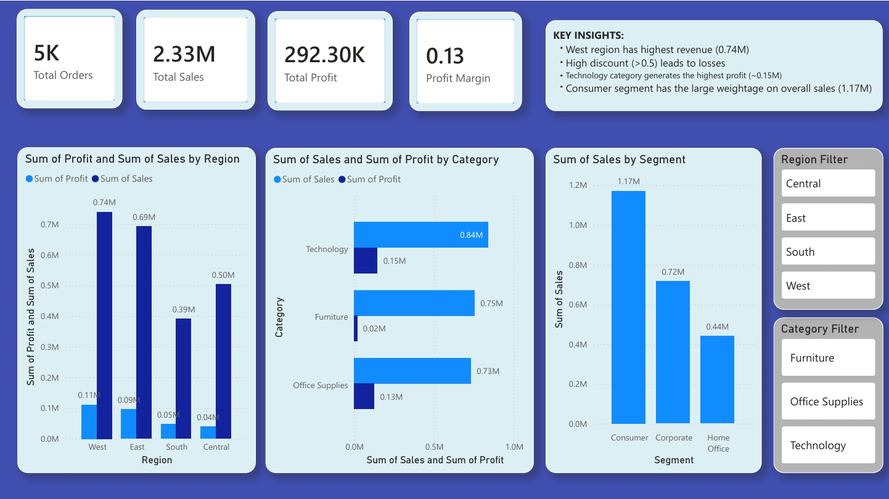
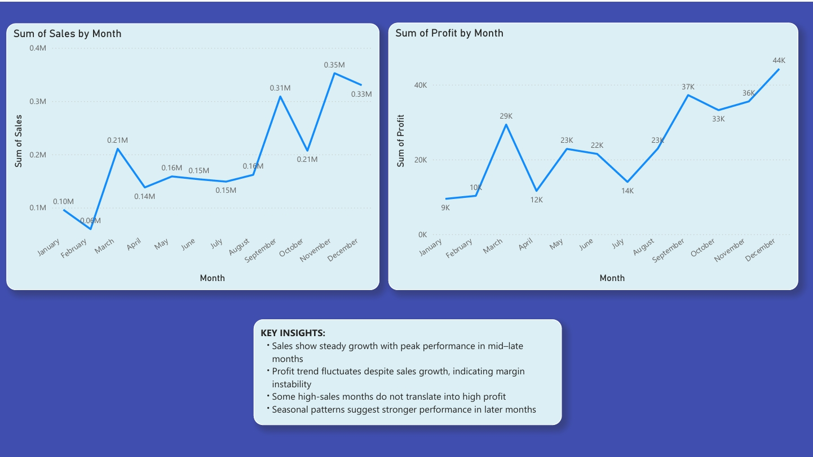
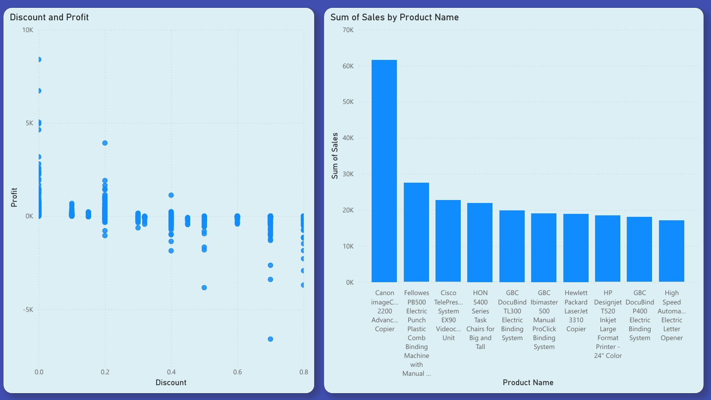

# 📊 Sales & Profit Dashboard (Power BI)

---

## 📌 Project Overview
This project analyzes sales performance, profitability, and business trends using **Power BI**.  
The dashboard provides insights into **regional performance, category efficiency, customer segments, and discount impact** to support data-driven decision-making.

---

## 🎯 Objectives
- Analyze revenue and profit performance  
- Identify high-performing regions and categories  
- Understand the impact of discounts on profitability  
- Track monthly sales and profit trends  

---

## 🛠 Tools Used
- **Power BI** (Data Modeling, Visualization, Power Query)

---

## 📈 Key Insights
- 📍 West region generates highest revenue (~0.74M)  
- 💻 Technology category contributes highest profit (~0.15M)  
- ⚠️ High discounts (>50%) lead to negative profit  
- 👥 Consumer segment contributes highest revenue (~1.17M)  

---

## 📊 Dashboard Preview

### 🔹 Overview

### 🔹 Trends Analysis

### 🔹 Detailed Analysis

---

## 📂 Dataset
- Superstore Sales Dataset (Tableau Public)  
🔗 https://public.tableau.com/app/sample-data/sample_-_superstore.xls

---

## 🚀 Conclusion
The analysis highlights that while revenue is strong, profitability is impacted by **high discounting and inefficient category performance**.  
By optimizing pricing strategies, reducing excessive discounts, and focusing on high-performing segments, the business can significantly improve overall performance.

---

## ⭐ Project Highlights
- Built interactive dashboards using Power BI  
- Analyzed 10,000+ sales records  
- Identified key business problems affecting profitability  
- Provided actionable insights for decision-making  

---
